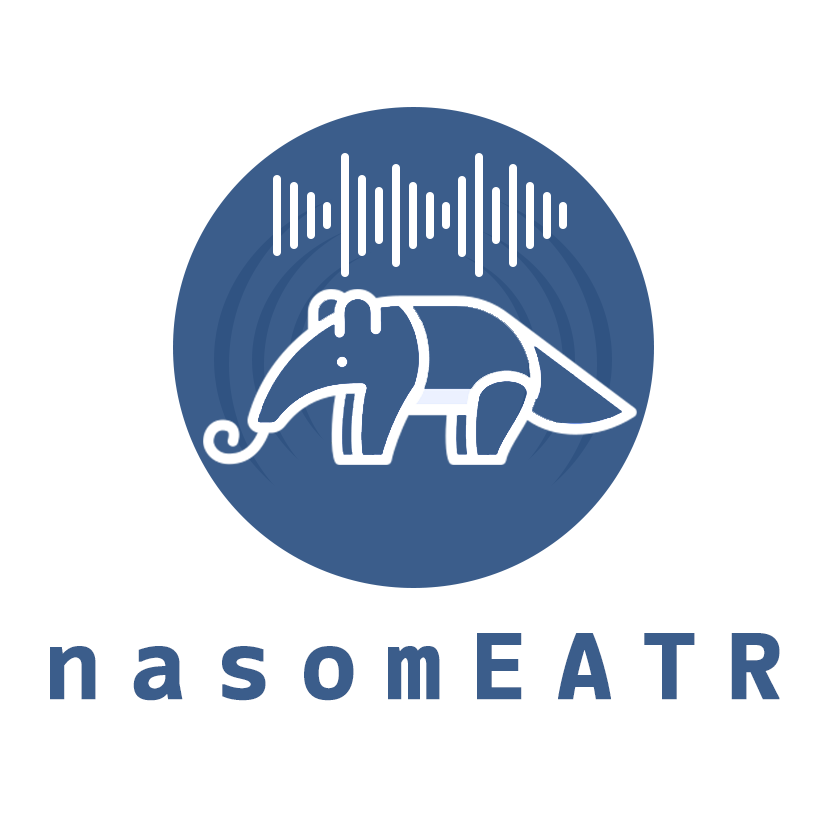
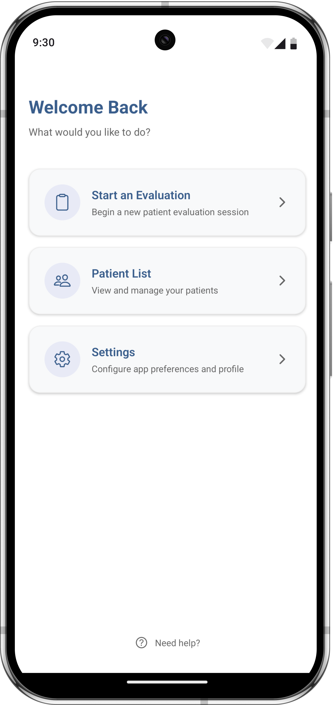
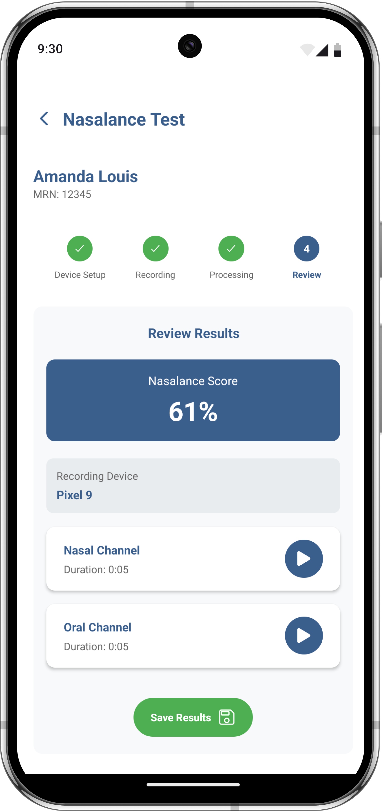
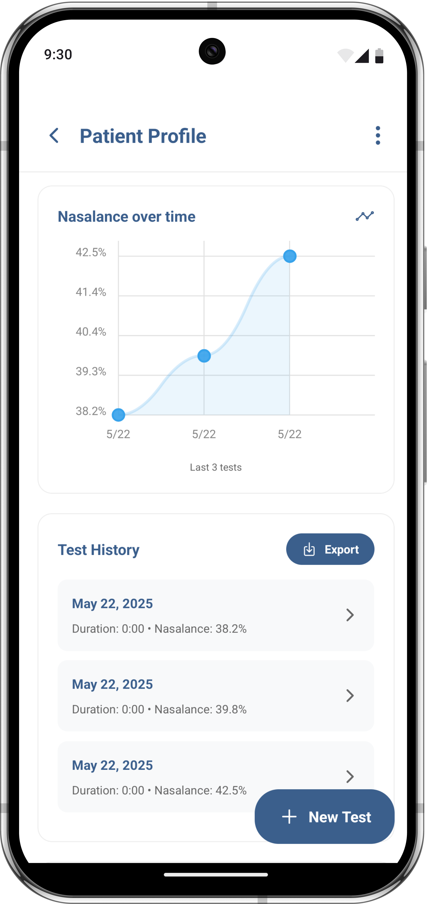

<p align="center">
  
</p>
<p align="center">A mobile application for nasalance measurement and speech assessment</p>

<p align="center">
  
  
  
  
</p>

## 📋 Table of Contents

- [Overview](#overview)
- [Features](#features)
- [Prerequisites](#prerequisites)
- [Database Setup](#database-setup)
- [Installation](#installation)
- [Configuration](#configuration)
- [Running the App](#running-the-app)
- [Key Components](#key-components)
- [Project Structure](#project-structure)
- [Technology Stack](#technology-stack)
- [Team](#team)
- [Contributing](#contributing)
- [License](#license)

## 🔍 Overview

nasomEATR is a specialized mobile application designed for speech-language pathologists and clinicians to measure and assess nasalance in patients. The app uses dual-microphone input to simultaneously record oral and nasal acoustic data, analyze speech patterns, and provide real-time feedback on nasalance measurements.

## 📱 App Screenshots

<table>
  <tr>
    <td></td>
    <td></td>
    <td></td>
  </tr>
</table>

## ✨ Features

### Authentication
- **Account Creation & Login**: Create and access accounts using email and password
- **Secure Authentication**: Authentication powered by Supabase

### Patient Management
- **Patient Creation**: 
  - Create new patient profiles with Medical Record Number (MRN)
  - Assign sex (M/F) and date of birth
  - Add demographic information (languages, ethnicity, race, country of origin)
- **Patient Editing**: Edit patient information after creation
- **Patient Profiles**:
  - View comprehensive patient information and demographics
  - Track total evaluations and average nasalance scores
  - View nasalance trends over time via graphical representation
  - Export evaluation results to CSV
  - Add clinical notes to patient profiles

### Nasalance Evaluation
- **Device Connection**: Connect to compatible stereo microphones via USB-C transmitter
- **Audio Recording**: Record from dual microphone sources simultaneously
- **Audio Processing**: On-device audio splitting into oral and nasal channels
- **Result Analysis**: View nasalance scores after recording
- **Audio Playback**: Play back audio from both oral and nasal channels


#### Sound pressure level

**Sound pressure level (SPL)** or **acoustic pressure level (APL)** is a logarithmic measure of the effective pressure of a sound relative to a reference value.

Sound pressure level, denoted *L*<sub>*p*</sub> and measured in dB.

$$
L_p = \ln\left(\frac{p}{p_0}\right)\text{ Np} = 2\log_{10}\left(\frac{p}{p_0}\right)\text{ B} = 20\log_{10}\left(\frac{p}{p_0}\right)\text{ dB,}
$$

where

*   *p* is the root mean square sound pressure,
*   *p*<sub>0</sub> is a **reference sound pressure**,
*   1 Np is the neper,
*   1 B = ($\frac{1}{2}\ln 10$) Np is the bel,
*   1 dB = ($\frac{1}{20}\ln 10$) Np is the decibel.

You can actually test out and grab the SPL from bitstreams through using a python script, something like so will do:
```python
y, sr = librosa.load(audio_path)

rms = librosa.feature.rms(y=y, frame_length=512)[0] # Get RMS energy
rsp = 20e-6                                         # Reference Sound Pressure
spl_db = 20 * np.log10(rms / rsp)

mean_spl = np.mean(spl_db)
max_spl = np.max(spl_db)
min_spl = np.min(spl_db)
```

Otherwise, you can calculate the sound pressure level through this [equation](https://www.sciencedirect.com/science/article/abs/pii/S0165587620302500#:~:text=It%20is%20reported%20as%20a,signal%20%5B10%2C11%5D):

$$
\text{nasalance (\%)} = \frac{\text{nasal SPL}}{\text{nasal SPL} + \text{oral SPL}} \times 100
$$

over the course of the audio file / recorded period for our pediatric patient that easily with just 2 mics.


### Test Details
- **Analysis**: Identification of low/high nasalance
- **Playback**: Review audio recordings from both channels
- **Device Info**: Display details of connected recording devices

### Settings
- **Microphone Testing**: Test microphones without saving to patient profiles

## 🛠️ Prerequisites

Before installing nasomEATR, ensure you have the following:

- **Node.js** (v16 or newer)
- **npm** (v8 or newer) or **yarn** (v1.22 or newer)
- **Git**
- **Android Studio** (for Android development)
  - Android SDK Platform 33+
  - Android SDK Build-Tools 33.0.0+
  - Android Virtual Device (or physical device)
- **JDK 11** or newer
- **Expo CLI** (`npm install -g expo-cli`)
- **eas-cli** (`npm install -g eas-cli`)

## 🗄️ Database Setup

Follow these steps to set up the Supabase database for nasomEATR:

1. Create a Supabase account using your GitHub or email account. If you already have a Supabase account, create a new organization for this project.

2. Using the SQL Editor in Supabase, create the following tables in the exact order provided:

```sql
create table public.clinician (
 id uuid not null,
 email text null,
 username text null,
 full_name text null,
 constraint clinician_pkey primary key (id),
 constraint clinician_email_key unique (email),
 constraint clinician_id_key unique (id),
 constraint clinician_username_key unique (username),
 constraint clinician_id_fkey foreign KEY (id) references auth.users (id)
) TABLESPACE pg_default;


create table public.patient (
 mrn bigint not null,
 full_name text null,
 dob date null,
 created_at timestamp with time zone not null default now(),
 assigned_clinician uuid null,
 gender public.gender null,
 picture_url text null,
 notes text null,
 first_language text null,
 second_language text null,
 ethnicity text null,
 race text null,
 country text null,
 constraint patient_pkey primary key (mrn),
 constraint patient_mrn_key unique (mrn),
 constraint patient_assigned_clinician_fkey foreign KEY (assigned_clinician) references clinician (id)
) TABLESPACE pg_default;


create table public.patient_data (
 id bigint generated by default as identity not null,
 avg_nasalance_score double precision null,
 created_at timestamp with time zone not null default now(),
 nasal_audio text null,
 oral_audio text null,
 nasalance_data jsonb null,
 mrn bigint null,
 constraint patient_data_pkey primary key (id),
 constraint patient_data_audio_link_key unique (nasal_audio),
 constraint patient_data_id_key unique (id),
 constraint patient_data_oral_audio_key unique (oral_audio),
 constraint patient_data_mrn_fkey foreign KEY (mrn) references patient (mrn)
) TABLESPACE pg_default;
```

## 📥 Installation

1. Clone the repository:
   ```bash
   git clone git@github.com:bluetooth-nasometer/nasomEATR.git
   cd nasomEATR
   ```

2. Install dependencies:
   ```bash
   npm install
   # or
   yarn install
   ```

## ⚙️ Configuration

1. **Supabase Configuration**:
   - Create a `.env` file in the root directory:
   ```
   REACT_APP_SB_API_KEY="your_supabase_api_key"
   ```

2. **Android Configuration**:
   - Enable Developer options and USB Debugging on your Android device:
     - Go to Settings > About phone > Tap "Build number" 7 times
     - Return to Settings > System > Developer options
     - Enable USB debugging
   
   - For Windows:
     Ensure `android/local.properties` has the correct SDK path:
     ```
     sdk.dir=C\:\\Users\\YourUsername\\AppData\\Local\\Android\\Sdk
     ```
   
   - For Linux:
     ```
     sdk.dir=/home/YourUsername/Android/Sdk
     ```

3. **Expo Configuration**:
   - The app uses Expo Development Client. No additional configuration is needed for basic development.

## 🚀 Running the App

### With Android Studio & Physical Device

1. Connect your Android device via USB
2. Enable USB debugging on your device
3. Run the following command:
   ```bash
   npm run android
   # or
   yarn android
   ```

4. Alternatively, open the Android project in Android Studio:
   ```bash
   cd android
   ```
   Then open the folder in Android Studio and click "Run"

### Using Expo

1. Start the Expo development server:
   ```bash
   npm start
   # or
   yarn start
   ```

2. Use the Expo Go app on your device to scan the QR code, or press 'a' in the terminal to open on Android

## 🔑 Key Components

### Audio Recording System

The app uses the `BluetoothRecorder` utility to manage audio recording and device connections:

```javascript
// Key methods in BluetoothRecorder.js
async startRecording(deviceId = null, onAmplitudeUpdate = null) {
  // Initialize recording session with Bluetooth device
}

async stopRecording() {
  // Stop recording and process audio files
}
```

### Supabase Integration

Authentication and data storage are managed through Supabase:

```javascript
// supabaseClient.js
export const supabase = createClient(supabaseUrl, supabaseKey, {
  auth: {
    storage: AsyncStorage,
    autoRefreshToken: true,
    persistSession: true,
    detectSessionInUrl: false,
  },
});
```

### Audio Visualization

Real-time audio visualization is handled by the `AudioVisualizer` component:

```javascript
// AudioVisualizer.js
const AudioVisualizer = ({ 
  splData, 
  nasalSplData, 
  nasalanceData, 
  stats, 
  timer 
}) => {
  // Render waveforms and nasalance graphs
};
```

### Native Modules

For advanced audio processing, the app includes native Android modules:

```java
// EnhancedAudioModule.java
public class EnhancedAudioModule extends ReactContextBaseJavaModule {
  @ReactMethod
  public void startRecording(String filePath, Promise promise) {
    // Native audio recording implementation
  }
}
```

## 📂 Project Structure

```
nasomEATR/
├── android/                  # Android native code
├── assets/                   # App assets (images, fonts)
├── components/               # React components
│   ├── common/               # Shared components
│   └── ...                   # Screen components
├── constants/                # App constants
├── modules/                  # Native modules
├── utils/                    # Utility functions
│   ├── BluetoothRecorder.js  # Audio recording utility
│   ├── supabaseClient.js     # Supabase connection
│   └── ...                   # Other utilities
├── App.js                    # App entry point
├── app.json                  # Expo configuration
├── index.js                  # JavaScript entry point
└── package.json              # Dependencies
```

## 💻 Technology Stack

- **Frontend**: [React Native](https://reactnative.dev/docs/getting-started), Expo
- **State Management**: React Hooks
- **Database/Backend**: Supabase
- **Authentication**: Supabase Auth
- **Audio Processing**: React Native AV, Native Modules
- **Data Visualization**: React Native Chart Kit
- **Navigation**: React Navigation
- **Storage**: Expo FileSystem, AsyncStorage
- **Bluetooth Integration**: React Native Bluetooth Classic

## 👥 Team

| Name | Role | Email |
| ---- | ---- | ----- |
| Jasper Doan | Team Lead | jasperd1@uci.edu / jasperdoan@gmail.com |
| Kaila Long | Team Member | kailal2@uci.edu |
| Baly A. Martinez | Team Member | balym@uci.edu |
| Vaani Mathur | Team Member | vaanim@uci.edu |
| John Norombaba | Team Member | jnoromba@uci.edu |
| Shayla My Tien Ho | Team Member | shaylamh@uci.edu |

## 🤝 Contributing

1. Fork the repository
2. Create your feature branch (`git checkout -b feature/amazing-feature`)
3. Commit your changes (`git commit -m 'Add some amazing feature'`)
4. Push to the branch (`git push origin feature/amazing-feature`)
5. Open a Pull Request

## 📄 License

This project is licensed under the MIT License - see the LICENSE file for details.

## 📱 Device Compatibility

- **Android**: Android 8.0+
- **iOS**: Not supported in current version (lacks necessary libraries)
- **Web**: Not supported in current version

## ❗ Known Limitations

- **Password Reset**: To reset an account's password, use the "Send Password Recovery" link on your Supabase project dashboard under Authentication > Users.
- **Deleting Evaluations**: Please use Table Editor in Supabase to delete individual evaluations from the public.patient_data table.
- **Edit Profile**: Please use the Table Editor in Supabase to change individual information like name from the public.clinician table.

## 📞 Support

For support or inquiries, please contact the team members listed above or open an issue in the GitHub repository.
